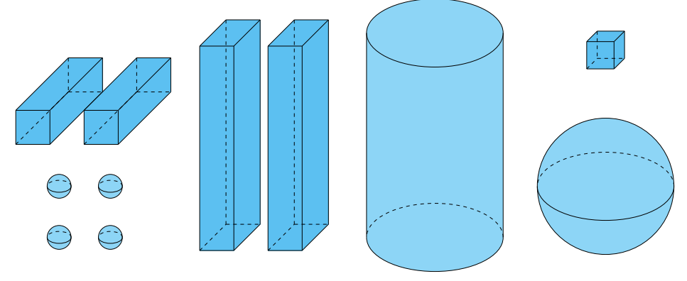
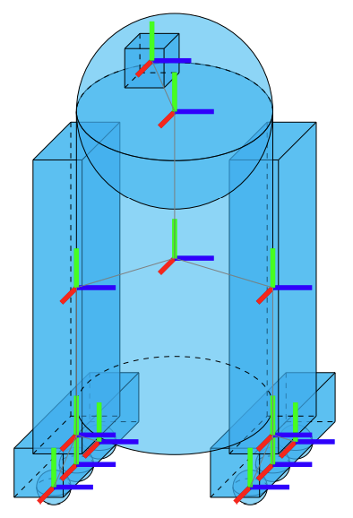

# **Nome do Robô:** Aplicação do robô

Trabalho de Interação Humano-Robô (IHR) apresentado ao Centro Universitário [FEI](https://portal.fei.edu.br/), como parte dos requisitos necessários para aprovação na disciplina de Interação Humano-Robô (IHR) (CCR230) do curso de Engenharia de Robôs, orientado pelo Prof. Dr. [Fagner de Assis Moura Pimentel](https://github.com/fagnerpimentel).

## Componentes do Grupo

- Thomas Ay Casa Grande
- Rafael Felix Rovina
- Enzo Figari Guillaumon
- Enzo Rodrigues Tofoli
- Gustavo Rodrigues Santos
- Matheus Kenji 

## Pensamentos - plateia - personas (apresentadores e plateia) - vai ter uma camera global e vai ter microfone para comunicação verbal (barulho de rato?)

## Resumo

O projeto consiste em um robô Micromouse adaptado para fins de interação humano-robô (IHR). Diferente do objetivo clássico de resolver labirintos em competições, este robô será utilizado em apresentações para demonstrar conceitos de robótica e engajamento com o público. O ambiente contará com uma câmera global voltada para a plateia, responsável por captar gestos e movimentos dos espectadores, permitindo que suas ações sejam interpretadas como comandos para o robô. Além disso, o sistema inclui um microfone que possibilita comunicação verbal, seja para reconhecer estímulos sonoros como palmas, seja para emitir sons característicos de um rato, criando sua identidade.

A dinâmica da apresentação envolve duas personas principais: os apresentadores, responsáveis por conduzir a explicação técnica e contextualizar o funcionamento do robô, e a plateia, que poderá interagir por meio de comandos simples ou estímulos sonoros. Essa configuração transforma o Micromouse em uma ferramenta de demonstração participativa, ampliando seu valor além da competição tradicional.

Em termos construtivos, o robô possui uma estrutura mecânica compacta e leve, adequada para movimentos ágeis em espaços delimitados. Seu sistema de locomoção diferencial, composto por dois motores independentes, garante precisão no deslocamento e nas curvas. O robô também é equipado com sensores de proximidade para identificar obstáculos, um módulo de processamento embarcado para controle de movimento e interpretação de dados, além da interface de interação formada por microfone e atuadores sonoros. Esses elementos garantem não apenas a execução de tarefas de navegação, mas também a capacidade de comunicação e resposta a estímulos externos.

Assim, o Micromouse deixa de ser apenas um robô de exploração de labirintos e se apresenta como uma plataforma interativa, educativa e envolvente, promovendo maior aproximação entre tecnologia, ciência e sociedade.

## Introdução

A interação humano-robô (IHR) vem se consolidando como um campo fundamental no desenvolvimento de tecnologias voltadas não apenas para a automação de tarefas, mas também para a comunicação, educação e engajamento social. Em um contexto onde a robótica está cada vez mais presente no cotidiano, é essencial criar soluções que despertem o interesse do público em geral, promovendo a compreensão de conceitos técnicos de forma acessível e lúdica. Nesse sentido, robôs que interagem diretamente com pessoas tornam-se ferramentas valiosas para divulgação científica, ensino de tecnologia e aproximação entre sociedade e inovação.

O robô desenvolvido neste projeto é baseado no conceito do Micromouse, tradicionalmente utilizado em competições de exploração de labirintos. Contudo, sua aplicação foi adaptada para um contexto interativo, no qual ele se torna uma plataforma de demonstração capaz de se comunicar com o público. O robô conta com locomoção autônoma em ambientes delimitados, sensores de proximidade para detecção de obstáculos, uma câmera global para acompanhamento de seus movimentos e um sistema de áudio que possibilita tanto a emissão de sons característicos de um rato quanto a recepção de estímulos verbais ou sonoros. Dessa forma, ele transforma uma aplicação originalmente competitiva em uma experiência educativa e envolvente.

O objetivo central do robô é: proporcionar uma experiência interativa e lúdica que aproxime o público da robótica por meio da exploração autônoma e da comunicação sonora.

Para os usuários, a experiência oferecida deve ser de curiosidade, engajamento e aprendizado prático, despertando interesse em tecnologia e ciência através de uma interação divertida, acessível e memorável.
## Publico Alvo

- Determine o seu público alvo: Plateia e Apresentador 

### Personas

*Persona Primária – Integrante da Plateia*

*Nome:* Lucas Andrade
*Idade:* 19 anos
*Ocupação:* Estudante do 1º ano de Engenharia Mecatrônica
*Local:* São Paulo – SP
*Perfil:* Jovem curioso, entusiasmado por tecnologia e ciência, gosta de descobrir como as coisas funcionam. Costuma ir a feiras, workshops e apresentações ligadas a inovação e robótica. Está sempre com o celular na mão para registrar e compartilhar momentos interessantes.

*O que o usuário vê*

* Um auditório ou espaço de apresentação.
* O robô micromouse se movimentando de forma demonstrativa.
* Os apresentadores conduzindo a atividade.
* Outros espectadores reagindo com entusiasmo, curiosidade ou distração.
* A câmera global captando a visão geral da plateia.

*O que o usuário ouve*

* A voz dos apresentadores explicando o funcionamento do robô.
* Reações da plateia (risadas, comentários, aplausos).
* Sons do robô: motores, rodinhas e eventualmente efeitos sonoros (como barulho de rato).
* Sons ambiente do auditório.

*O que o usuário diz e faz*

* Comenta com colegas ao lado.
* Ri ou reage às falhas/diversões.
* Usa o celular para filmar/fotografar o robô.
* Acompanha atentamente a demonstração.

*O que o usuário pensa e sente*

* Curiosidade sobre como o robô funciona.
* Surpresa e expectativa a cada movimento.
* Desejo de se divertir com a experiência.
* Admiração pela tecnologia aplicada em algo lúdico.
* Sente-se engajado quando há interação direta (perguntas, brincadeiras, sons).

*Dores*

* Pode se sentir entediado se a apresentação for lenta ou pouco envolvente.
* Dificuldade de enxergar/acompanhar se não houver boa visibilidade.
* Frustração caso o robô não funcione bem (travando, não respondendo).

*Ganhos*

* Experiência divertida e memorável.
* Aprende de forma leve sobre robótica.
* Satisfação em ver o robô funcionando corretamente.
* Entretenimento coletivo (dividir reações com os outros).

*Persona Primária - Apresentador*

Nome fictício: Marina Souza
Idade: 24 anos
Ocupação: Estudante de Pós-Graduação / Integrante da equipe de robótica (responsável pela apresentação e demonstração)
Local: São Bernardo do Campo – SP
Perfil: Comunicadora curiosa e técnica; gosta de ensinar e de transformar conceitos complexos em demonstrações interessantes. Tem experiência em workshops e apresentações acadêmicas, mas ainda sente certo nervosismo com imprevistos técnicos.

*O que o usuário vê*

* O público observando e reagindo.
* O micromouse em funcionamento demonstrativo.
* Os colegas apresentadores ajudando na condução.
* A câmera global e o microfone captando a cena.

*O que o usuário ouve*

* Murmúrios, risadas e comentários da plateia.
* Sons do robô (movimento, barulho de rato se houver).
* Feedback de colegas (sussurros, instruções rápidas).
* O retorno do próprio microfone.

*O que o usuário diz e faz*

* Explica o funcionamento do robô de forma clara.
* Faz piadas ou comentários para engajar a plateia.
* Incentiva o público a prestar atenção ou reagir.
* Coordena o início da demonstração.
* Responde perguntas feitas pelo público.

*O que o usuário pensa e sente*

* Ansiedade em manter a apresentação interessante.
* Orgulho em mostrar o projeto funcionando.
* Preocupação com possíveis falhas do robô.
* Confiança crescente à medida que percebe a reação positiva da plateia.

*Dores*

* Estresse caso o robô apresente erros ou pare de funcionar.
* Dificuldade em prender a atenção do público por muito tempo.
* Preocupação em transmitir informações técnicas de forma acessível.

*Ganhos*

* Satisfação ao ver o público engajado.
* Reconhecimento pelo esforço e dedicação ao projeto.
* Orgulho em apresentar algo inovador de forma lúdica.
* Experiência em comunicação e interação humano-robô.

### Mapa de empatia

- Determine o mapa de empatia[^1] de pelo menos uma persona primária e uma sercundária.
  - O que o usuário vê: aqui estamos falando do ambiente visual em que o usuário se encontra. Ou seja, o que ele efetivamente enxerga, as pessoas e objetos que estão ao seu redor. Isso ajuda a entender o contexto em que o usuário está inserido e as influências visuais que está recebendo.
  - O que o usuário ouve: neste quadrante, buscamos entender o que o usuário está ouvindo, os sons que o cercam e como eles influenciam suas ações.
  - O que o usuário diz e faz: aqui consideramos ações e comportamentos que o usuário apresenta durante sua interação com o robô.
  - O que o usuário pensa e sente: neste quadrante, buscamos entender os pensamentos, sentimentos, emoções e percepções que o usuário tem em relação robô. Quais expectativas o usuário cria sobre o robô?
  Que tipo de robô mais agrada essa persona?
  - Dores: quando falamos sobre dores do usuário, estamos fazendo referência a quaisquer obstáculos, necessidades ou frustrações que o usuário possa experimentar ao tentar realizar uma tarefa ou alcançar um objetivo. Isso inclui, por exemplo, problemas de usabilidade, dificuldades de acesso ou outros desafios que podem afetar a experiência do usuário.
  - Ganhos: nesse caso estamos falando de quaisquer benefícios ou recompensas que o usuário possa experimentar ao utilizar o robô. Isso pode incluir economia de tempo ou facilidade de uso, por exemplo. Que desejos do usuário o robô satisfaz?

## Contexto de uso

O robô será utilizado em ambientes de apresentação e demonstração, como feiras de ciência, eventos acadêmicos, salas de aula e atividades de divulgação tecnológica. Nesses espaços, a interação entre pessoas e robôs desempenha um papel fundamental para despertar a curiosidade do público e aproximar conceitos complexos de robótica de forma prática e divertida. O ambiente é projetado de maneira controlada, geralmente com um espaço delimitado semelhante a um pequeno labirinto ou arena, onde o Micromouse pode se movimentar com segurança.

O contexto social, econômico e cultural está fortemente associado à popularização da tecnologia e da robótica como ferramentas de aprendizado. Em um cenário em que a sociedade busca constantemente soluções inovadoras, o robô cumpre uma função educativa, estimulando o interesse de crianças, jovens e adultos em ciência, engenharia e programação. Do ponto de vista cultural, sua aplicação promove a democratização do acesso ao conhecimento tecnológico, permitindo que diferentes perfis de público tenham contato direto com conceitos de automação de forma lúdica e acessível. Do ponto de vista econômico, iniciativas como essa contribuem para formar futuros profissionais capacitados em áreas de alta demanda, como tecnologia e inovação.

Antes de iniciar a tarefa, o robô deve possuir informações básicas sobre o ambiente, incluindo:

Delimitação da área de atuação, evitando ultrapassar limites de segurança.

Posição inicial de onde será iniciado o percurso.

Presença e disposição de obstáculos que possam interferir na navegação.

Condições de iluminação e captação sonora, garantindo que a câmera global e o microfone funcionem adequadamente durante a interação.

Com esses elementos, o robô consegue realizar sua função de forma autônoma e interativa, proporcionando ao público uma experiência segura e envolvente.

## Jornada do usuário

- Criar uma narrativa para o o seu robô e o usuário.
- Determine o passo a passo que o usuário realiza desde o primeiro até o último encontro com robô na realização da tarefa.
- O que está acontecendo com o ambiente quando o robô está interagindo com o usuário?
  - Descreva o que acontece ou pode acontecer passo a passo
  - Como a tarefa começa? Como a tarefa evolui? Como a tarefa termina?
- Enfatize todos os momentos em que acontece uma interação verbal, não-verbal e espacial.

# Jornada de usuário — Micromouse IHR

> Versão formatada para GitHub (trecho solicitado)

---

## 1) Preparação / Configuração (pré-evento)

**Ambiente**

* Palco/área com iluminação uniforme.
* Câmera global apontada para a plateia (campo de visão pré-definido).
* Microfone do ambiente testado.
* Robô na doca.
* Telão opcional exibindo instruções e área válida de gestos (overlay).

**Passos**

1. Marina liga o sistema: painel mostra `READY`.
2. Equipe realiza calibração rápida da câmera (detecção de mãos, zoneamento) e do microfone (nível de ruído).
3. Robô executa sinal de "pronto" (LED, som curto).

**Interações**

* **Não-verbal (espacial):** marcar no chão a “zona de segurança” e a “zona de interação” para a plateia.
* **Verbal:** comunicação interna da equipe (“calibrei”, “go”).
* **Importante:** registrar modo fallback (demo/manual) ativo.

---

## 2) Abertura / Introdução (primeiro contato)

**Como começa**

* Marina apresenta o Micromouse: função, “personalidade” e como interagir (gestos válidos, palmas, palavras-chave).

**Ambiente**

* Telão mostra instruções curtas; câmera sobre a plateia exibe retângulos/overlay em tempo real indicando onde gestos serão detectados.

**Passos**

1. Marina explica e demonstra: ela faz o gesto (p.ex. aceno) e a câmera exibe a detecção no telão.
2. Público observa; alguns (como Lucas) testam com palmas/levantar a mão.

**Interações**

* **Verbal:** Marina diz “Aplaudam ou acenem para chamar o robô!”.
* **Não-verbal:** plateia faz palmas/acenos; a câmera detecta e destaca quem gesticulou.
* **Espacial:** o robô inicia na doca; quando um gesto é identificado, ele calcula um ponto alvo na área de atuação e realiza aproximação segura.

**Resultado esperado**

* Primeiro reconhecimento → robô responde com movimento curto + som + LED.

---

## 3) Convite à interação (instruções / engajamento inicial)

**Objetivo**

* Engajar múltiplas pessoas, mostrar variações de entrada (palmas vs aceno vs voz).

**Ambiente**

* Overlay no telão mostra ícones de gesto reconhecido; painel do apresentador indica qual comando foi reconhecido.

**Passos**

1. Marina convida grupos da plateia a testar diferentes comandos (ex.: palmas = andar; aceno = virar; grito = brincar).
2. Câmera identifica áreas ativas e envia rótulo do gesto ao módulo de decisão.
3. Robô confirma recebimento com bip curto + LED e executa ação.

**Interações (destacadas)**

* **Verbal:** Marina orienta e faz perguntas rápidas (“Quem conseguiu acenar?”).
* **Não-verbal:** plateia usa celulares para gravar; expressão coletiva de validação (risos).
* **Espacial:** robô aproxima-se até a “zona de interação” sem cruzar a barreira de segurança.

**Fallback**

* Caso a câmera não detecte bem (p.ex. pouca luz), Marina aciona modo manual: botão no controle concede comando direto.

---

## 4) Loop de interação (ciclo contínuo)

**Descrição**

* Ciclo repetitivo: plateia emite estímulos → sistema reconhece → robô age → público reage → repetição.

**Fluxo técnico simplificado**

1. **Detecção** (câmera: gesto / microfone: som)
2. **Classificação** (modelo decide qual comando corresponde)
3. **Planejamento** (decisão do movimento / som / LED)
4. **Execução** (robô realiza)
5. **Feedback** (audível/visual)
6. **Reação da plateia** (aplausos, risos) → volta ao 1

**Interações**

* **Verbal:** público comenta e faz perguntas entre ciclos; apresentador contextualiza tecnicamente por breves blocos.
* **Não-verbal:** mudança de postura do público (mais perto/mais distante), filmagens.
* **Espacial:** robô navega entre pontos de interesse (zona A → zona B), mantendo rota segura e evitando bordas/obstáculos.

**Métricas visíveis**

* Contador no painel: número de interações reconhecidas, taxa de sucesso.

**Falha sensorial**

* Ruído intenso → priorizar detecção de gestos visuais; telão mostra aviso “modo visual ativo”.

---

## 5) Clímax demonstrativo (sequência combinada)

**Propósito**

* Entregar uma sequência coreografada que une múltiplas entradas da plateia e mostra robustez (p.ex. coreografia de 4 passos acionada por 4 palmas de diferentes locais).

**Ambiente**

* Obstáculos temporários (blocos leves) montados para mostrar desvio/curva precisa; telão faz contagem regressiva.

**Passos**

1. Marina solicita colaboração coletiva (ex.: “em 3… 2… 1… palmas!”).
2. A câmera detecta multiplicidade de entradas; o módulo combina sinais (votos) e decide comportamento especial.
3. Robô executa sequência (movimentos precisos + som característico + LED em padrão).

**Interações**

* **Verbal:** contagem regressiva cria expectativa; Marina descreve o que vai acontecer.
* **Não-verbal:** plateia participa em sincronia; muitos gravam.
* **Espacial:** robô navega por mini-labirinto/coreografia evitando toque humano.

**Se ocorrer falha**

* Plano B: exibir gravação da sequência no telão e explicar tecnicamente por que a falha ocorreu.

---

## 6) Encerramento (despedida / call-to-action)

**Como termina**

* Robô volta à doca ou executa gesto de despedida; Marina faz agradecimentos e convida à interação pós-show.

**Passos**

1. Robô executa sinal de final (movimento recuado + som/LED).
2. Marina agradece e convida para visitar a estação prática ou acessar material via QR code.
3. Equipe disponibiliza rota segura para que interessados se aproximem (se permitido).

**Interações**

* **Verbal:** agradecimentos e instruções para o pós-evento.
* **Não-verbal:** aplausos; selfies com o robô.
* **Espacial:** robô é levado para área controlada onde o público pode testar sob supervisão.

---

## 7) Pós-evento (estações / análise)

**Atividades**

* Perguntas técnicas; demonstração do hardware por partes; logs de interação são analisados.

**Passos**

1. Equipe mostra dashboards (nº de interações, reconhecimento por tipo).
2. Público experimenta o robô em modo supervisionado (com limites de movimento).
3. Equipe anota melhorias e coleta feedback via formulário/QR.

**Interações**

* **Verbal:** conversas mais longas e técnicas; recrutamento/contato.
* **Não-verbal:** manipulação direta do robô (em área segura).
* **Espacial:** área com barreiras baixas para controle.

## Análise de concorrência

- Pesquise robôs existentes atualmente que possam fazer a tarefa deste projeto.
- Selecione pelo menos 3 robôs diferentes que podem fazer essa tarefa.
- Em relação aos concorrentes, respondam as seguintes perguntas?
  - Existe plataforma similar que atende o mesmo mercado e funcionalidades? Se sim: Quais os pontos positivos? Quais os pontos negativos?
  - Existe plataforma diferente quanto ao serviço, mas que atenda esse mercado? Se sim: Quais os pontos positivos? Quais os pontos negativos?
  - Quais plataformas sua equipe acha mais interessantes? Qual a justificativa?

## Design

- Pense nas características de Affordances do seu robô. Que tipo de acessibilidades devem ser consideradas dentro do seu projeto?
- Discuta o papel das expectativas do usuário no projeto de um robô. Qual a importância e pontos a serem considerados se você quiser vender esse robô  seu robô?
- O seu robô tem um padrão com mais ou menos características antropomórficas? Qual padrão é mais aceito pela sociedade dentro do projeto que você está desenvolvendo?
- Quais o design mais apropriado para o robô deste projeto? Modele o seu robô com desenhos de formas primitivas (caixas, cilindros, esferas)

<!--  -->
<!--  -->

## Ações do robô

- Para cada ação:
  - Descreva a ação.
  - Determine os pré-requisitos para que a ação aconteça
  - Determine o que se espera que seja modificado no ambiente quando a ação é finalizada

## Interações do robô

### Espacial

- Para cada interação:
  - Descreva a interação.
  - Determine os pré-requisitos para que a interação aconteça
  - Determine espera de resposta emocional do usúario quando a interação é finalizada

### Verbal

- Para cada interação:
  - Descreva a interação.
  - Determine os pré-requisitos para que a interação aconteça
  - Determine espera de resposta emocional do usúario quando a interação é finalizada

### Não-verbal

- Para cada interação:
  - Descreva a interação.
  - Determine os pré-requisitos para que a interação aconteça
  - Determine espera de resposta emocional do usúario quando a interação é finalizada

[^1]: Fonte: Adaptado de <https://hazeshift.com.br/mapa-de-empatia/>

<!-- TODOs:
- Add exemplos
 -->
